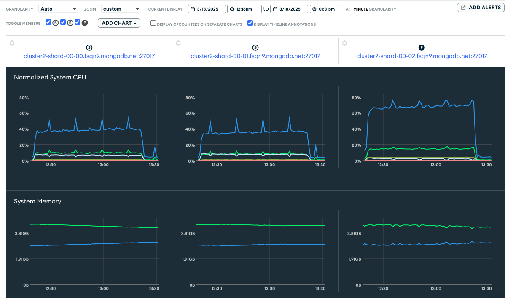
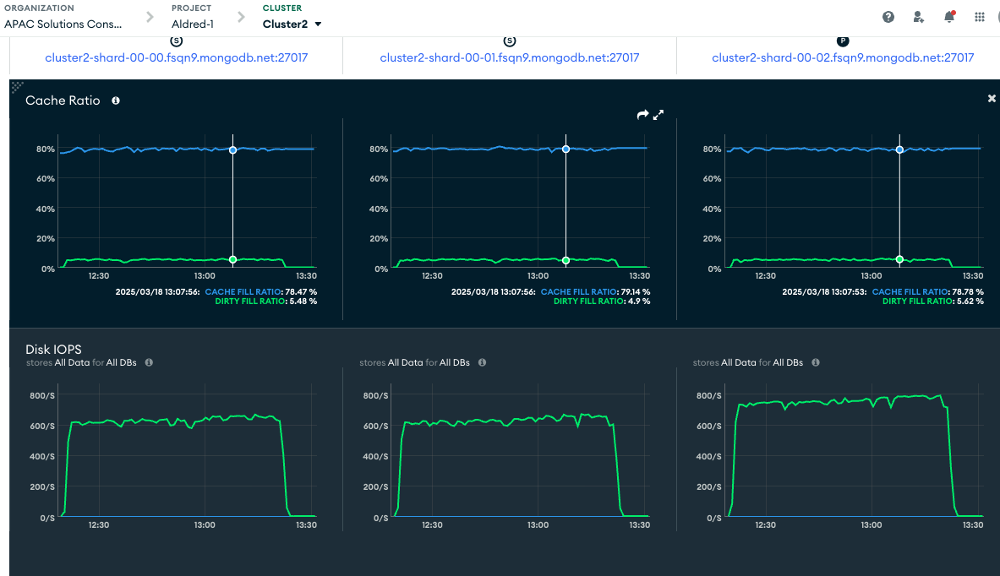
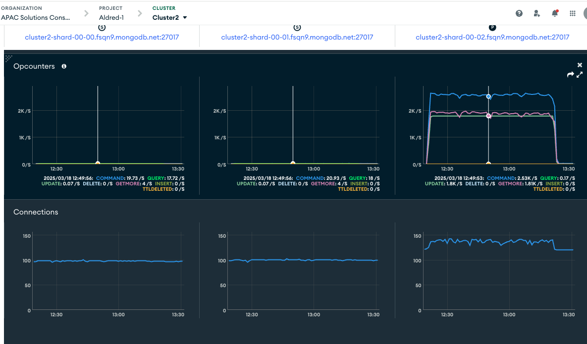
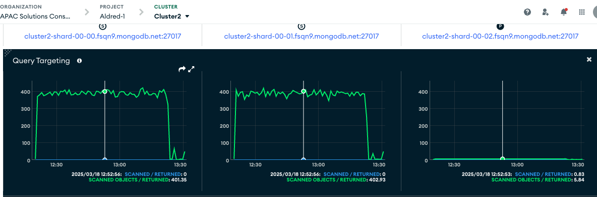

# Starbucks SG Transaction Contention Demo

## Prerequisites

1. Provision M30 cluster on Atlas
2. Install NodeJS v20
3. Install `k6`

Set environment variable for the cluster connection string

```bash
export CLUSTER2=<your connection string>
```

Install dependencies

```bash
npm ci
```

In your cluster, create a database called `starbucks` and 2 collections, `orders` and `wallets`. Create wallets

```bash
node generateWallets.js
```

## Simple Contention Demo

Create a wallet

```js
use("starbucks")
db.wallets.insertOne({"_id": "A1","balance": 150});
```

### Without retry

Run the first transaction

```bash
node updateWallet.js --sleep 5000 --walletId A1 --amount 50

# Update result: {"acknowledged":true,"modifiedCount":1,"upsertedId":null,"upsertedCount":0,"matchedCount":1}
# updateResult - Sufficient balance for wallet: A1
# Sleeping for 5000ms before committing...
# Sleep finished, now committing transaction
# Transaction committed successfully
# MongoDB connection closed
```

When the first transaction is sleeping, in another terminal, run a similar code.

Notice that there is transaction collision, and the 2nd transaction is rejected.

```bash
node updateWallet.js --walletId A1 --amount 50 --maxRetries 0

# TransientTransactionError encountered: Caused by :: Write conflict during plan execution and yielding is disabled. :: Please retry your operation or multi-document transaction.
# Maximum retry attempts (0) reached. Giving up.
# MongoDB connection closed
```

Balance will be `100`

```js
use("starbucks")
db.wallets.find({"_id": "A1"});

// {
//   _id: 'A1',
//   balance: 100
// }
```


### With retry

Run the first transaction

```bash
node updateWallet.js --sleep 5000 --walletId A1 --amount 50

# Update result: {"acknowledged":true,"modifiedCount":1,"upsertedId":null,"upsertedCount":0,"matchedCount":1}
# updateResult - Sufficient balance for wallet: A1
# Sleeping for 5000ms before committing...
# Sleep finished, now committing transaction
# Transaction committed successfully
# MongoDB connection closed
```

When the first transaction is sleeping, in another terminal, run a similar code.

Notice that there is transaction collision, and the 2nd transaction is rejected. But this time, there's automatic retry in the code to perform the transaction again.

```bash
node updateWallet.js --walletId A1 --amount 50

# TransientTransactionError encountered: Caused by :: Write conflict during plan execution and yielding is disabled. :: Please retry your operation or multi-document transaction.
# Retry attempt 1/2 in 5 seconds...
# Update result: {"acknowledged":true,"modifiedCount":1,"upsertedId":null,"upsertedCount":0,"matchedCount":1}
# updateResult - Sufficient balance for wallet: A1
# Sleeping for 0ms before committing...
# Sleep finished, now committing transaction
# Transaction committed successfully
# MongoDB connection closed
```

Balance will be `0`

```js
use("starbucks")
db.wallets.find({"_id": "A1"});

// {
//   _id: 'A1',
//   balance: 0
// }
```

### Insufficient Balance

When the balance is 0, running the transaction again will cause the transaction to be aborted.

```js
node updateWallet.js --walletId A1 --amount 50

// Update result: {"acknowledged":true,"modifiedCount":0,"upsertedId":null,"upsertedCount":0,"matchedCount":0}
// updateResult - Insufficient balance for wallet: A1
// An error occurred in the transaction, aborting:Insufficient balance for wallet: A1
// MongoDB connection closed
```

## K6 Demo

`k6` is a popular load testing tool

### Setup

Start a lightweight REST API server

```bash
node fastify-bridge-server.js
```

Sanity test

```bash
curl -X POST http://localhost:3001/execute-transaction \
  -H "Content-Type: application/json" \
  -d '{
    "walletId": "W4", 
    "amount": 1, 
    "maxRetries": 3, 
    "retryDelay": 2, 
    "sleep": 0
  }'
```

### Non-negative Balance Demo

```bash
node generateContentionWallets.js
```

See that there are 100 wallets that start with `SW` prefix

```js
use("starbucks")
db.wallets.find({ contentionTest: true });
```

Run 100 TPS for 30 seconds. Within 8 seconds, the balance of all the shared wallets will have been depleted and you start to see "Insufficient balance" error messages 

```bash
k6 run mongodb-wallet-contention-test.js
```

You'll see a similar report to below. High `insufficient_balance_rejections` is expected, since the balance runs quickly. A HTML report in `k6_reports` folder will be generated


```txt
    ✓ status is 200
     ✓ transaction completed
     ✗ transaction succeeded
      ↳  33% — ✓ 992 / ✗ 2009
     ✓ if failed, balance not negative

     checks............................: 83.26% ✓ 9995       ✗ 2009 
   ✓ contention_rate...................: 0.00%  ✓ 0          ✗ 0    
     data_received.....................: 825 kB 28 kB/s
     data_sent.........................: 749 kB 25 kB/s
     http_req_blocked..................: avg=9.83µs  min=2.55µs med=3.94µs  max=306.23µs p(90)=6.56µs  p(95)=10.56µs
     http_req_connecting...............: avg=3.51µs  min=0s     med=0s      max=210.21µs p(90)=0s      p(95)=0s     
   ✓ http_req_duration.................: avg=4.43ms  min=2.78ms med=3.24ms  max=15.31ms  p(90)=7.1ms   p(95)=7.34ms 
       { expected_response:true }......: avg=4.43ms  min=2.78ms med=3.24ms  max=15.31ms  p(90)=7.1ms   p(95)=7.34ms 
   ✓ http_req_failed...................: 0.00%  ✓ 0          ✗ 3001 
     http_req_receiving................: avg=35.18µs min=19.3µs med=29.91µs max=115.25µs p(90)=53.17µs p(95)=59.26µs
     http_req_sending..................: avg=22.72µs min=8.83µs med=18.57µs max=105.4µs  p(90)=33.95µs p(95)=38.72µs
     http_req_tls_handshaking..........: avg=0s      min=0s     med=0s      max=0s       p(90)=0s      p(95)=0s     
     http_req_waiting..................: avg=4.37ms  min=2.74ms med=3.18ms  max=15.23ms  p(90)=7.03ms  p(95)=7.26ms 
     http_reqs.........................: 3001   100.011044/s
   ✓ insufficient_balance_rejections...: 2009   66.951745/s
     iteration_duration................: avg=4.65ms  min=2.96ms med=3.46ms  max=15.7ms   p(90)=7.36ms  p(95)=7.63ms 
     iterations........................: 3001   100.011044/s
   ✗ transaction_success...............: 33.05% ✓ 992        ✗ 2009 
     vus...............................: 0      min=0        max=1  
```


Check that no wallets have balance below 0

```js
// Some might have 0 balance
use("starbucks")
db.wallets.find({ contentionTest: true, balance: {$lte: 0}})

// None will have balance less than 0
use("starbucks")
db.wallets.find({ contentionTest: true, balance: {$lt: 0}})
```

### Load test

Run an hour long load test. 30% of the requests are going to go 5% of the total number of wallets to simulate contention.

```bash
k6 run --summary-trend-stats "min,avg,med,max,p(95),p(99)" mongodb-transaction-load-test.js
```

There will be an output similar to the following. A HTML report in `k6_reports` folder will be generated

```txt
     ✓ status is 200
     ✓ transaction completed
     ✓ transaction succeeded
     ✗ no retries needed
      ↳  99% — ✓ 2201118 / ✗ 71

     checks.........................: 99.99%  ✓ 8804685    ✗ 71     
     data_received..................: 613 MB  165 kB/s
     data_sent......................: 583 MB  157 kB/s
     dropped_iterations.............: 811     0.21801/s
     http_req_blocked...............: min=1.6µs  avg=2.84µs  med=2.6µs   max=388.16µs p(95)=3.82µs  p(99)=5.34µs 
     http_req_connecting............: min=0s     avg=1ns     med=0s      max=203.45µs p(95)=0s      p(99)=0s     
   ✓ http_req_duration..............: min=5.55ms avg=10.7ms  med=9.67ms  max=2.03s    p(95)=16.77ms p(99)=26.34ms
       { expected_response:true }...: min=5.55ms avg=10.7ms  med=9.67ms  max=2.03s    p(95)=16.77ms p(99)=26.34ms
   ✓ http_req_failed................: 0.00%   ✓ 0          ✗ 2201189
     http_req_receiving.............: min=9.77µs avg=27.91µs med=26.61µs max=7.41ms   p(95)=39.7µs  p(99)=52.61µs
     http_req_sending...............: min=5.62µs avg=13.81µs med=14.16µs max=7.41ms   p(95)=20.24µs p(99)=33.23µs
     http_req_tls_handshaking.......: min=0s     avg=0s      med=0s      max=0s       p(95)=0s      p(99)=0s     
     http_req_waiting...............: min=5.51ms avg=10.66ms med=9.63ms  max=2.03s    p(95)=16.73ms p(99)=26.29ms
     http_reqs......................: 2201189 591.716388/s
     iteration_duration.............: min=5.7ms  avg=10.83ms med=9.8ms   max=2.03s    p(95)=16.9ms  p(99)=26.46ms
     iterations.....................: 2201189 591.716388/s
   ✓ transaction_retries............: 71      0.019086/s
   ✓ transaction_success............: 100.00% ✓ 2201189    ✗ 0      
   ✓ transient_errors...............: 0       0/s
     vus............................: 0       min=0        max=28   

running (1h02m00.0s), 00/30 VUs, 2201189 complete and 0 interrupted iterations
```

Metrics from Atlas







